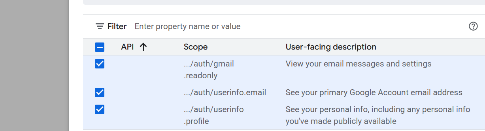

# PhiWatch (Email Phishing Analyzer) - A Desktop App
---
with the help of this desktop based app you can log into your email and analyze every single email for phishing with reasons and point system on a scale of 100

## <u>Demo Video</u>:
https://www.linkedin.com/posts/rohitmaity_python-python3-developer-activity-7386416326912888832-dtbo?utm_source=share&utm_medium=member_desktop&rcm=ACoAAD0Qjt0BVIj8_enLYbO7cC4Dwm3cF_K8Dqw

## <u>Requirements</u>:
- I alreay given you the `requirements.txt`file.
- you have to setup your Oauth for your Gmail.
## <u>Process to setup your Oauth</u>:
1. go to [Google Console](https://console.cloud.google.com/)
2. select on My First Project and select New Project
3. give any name to your project
4. then click on API and Services from side pane
5. then with Enabled API selected search Gmail API if it is already installed then good either install that first
6. then go to Oauth Consent screen and go to Data Access page and select these 3 as shown in the image below

7. then go for credentials and create new credentials
8. select Oauth Clint ID and select Desktop App.
9. now give any name and then download as credentials.json
10. place that file into main directory.

## <u>Features</u>:
1. It has good error handling mechanism.
2. Login through Google Oauth functionality
3. Once you logged in through google, it will store your email so you don't have to logged into every single time.
4. no problems with GUI when resizing.
5. if and only if it detect any malicious link through any online detector engine then only it will produce report. 

### This is totally my own personal project

